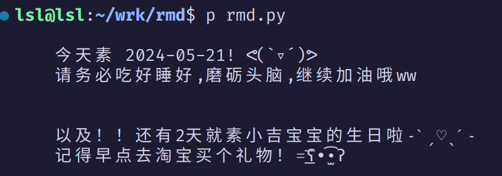

# rmd.py

A simple command line anniversary reminder made with python, never forget your friends' birthdays : )

## Usage

Just clone this repo, cd into it and run `python3 rmd.py` (You can give it an alias if you like)
To make the reminder appear every time you open a shell, just add the command above into your .bashrc (or .zshrc, whatever), and that's all! XD

## Config

All configs lie in config.py, you can easily read through it cuz it's really really simple. I'm not gonna write a doc here since you'll immediately understand what everything means when you open it.
Use a -e command line option to edit.

```
python3 rmd.py -e
```

The default editor is vim, while it is also customizable.

## Screenshots


